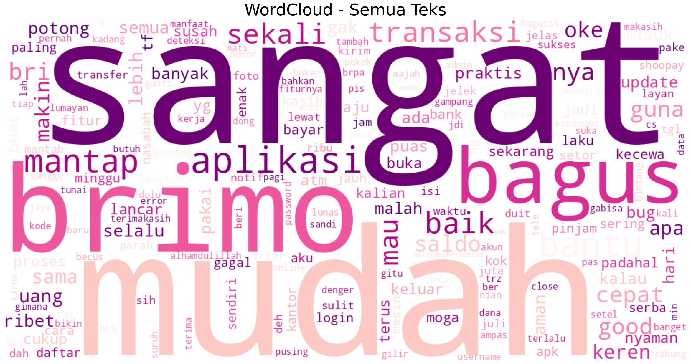

# 💳 Sentiment Analysis BRIMO Mobile Banking Application using TextBlob and Naive Bayes

Proyek ini merupakan analisis sentimen terhadap ulasan pengguna aplikasi mobile banking `BRIMO` yang dimiliki Bank BRI.
Ulasan pengguna ini didapatkan melalui metode scraping di Google Play Store. Tujuan utama dari proyek ini adalah untuk
memahami persepsi pengguna terhadap aplikasi ini melalui klasifikasi sentimen.

## 🗂️ Struktur Proyek
```
├───dashboard
| ├───review_brimo.csv
| ├───review_brimo_clean.csv
| └───review_brimo_translate.csv
├───image
| ├───all_wordcloud.png
├───README.md
|───scrapping_review.ipynb
└───sentiment_analysis.ipynb
```

submission
├───dashboard
| ├───main_data.csv
| └───dashboard.py
├───data
| ├───data_1.csv
| └───data_2.csv
├───notebook.ipynb
├───README.md
└───requirements.txt
└───url.txt

## 🧰 Library
Python, Pandas, Matplotlib & Seaborn, WordCloud, Sastrawi, TextBlob & NaiveBayesClassifier, NLTK, Translate

## ⚙️ Langkah Analisis
1. Scraping dengan menggunakan library `google_play_scrapper` kemudian menyimpan hasil scraping kedalam `format csv`
2. Import dan melakukan pembersihan data dengan menghapus karakter khusus, angka, url serta melakukan tokenisasi dan stemming menggunakan `sastrawi`
3. Melakukan labeling dengan menerjemahkan teks dari bahasa Indonesia ke bahasa Inggris dan menggunakan `TextBlob` untuk menentukan polaritas. Setelah itu memberikan label `positiv`, `negative`, atau `netral`
4. Melatih model menggunakan `NaiveBayesClassifier`
5. Visualisasi dengan `WordCloud` untuk melihat kata yang sering muncul dan grafik distribusi sentimen
6. Mendapatkan insight dari hasil analisis

## 📊 Visualisasi
<p align='center'>
  
  🖼️ Tampilan WordCloud Semua Sentimen

## 📌 Insight yang Didapat
Berdasarkan hasil analisis yang didapatkan, mayoritas ulasan pengguna terkait aplikasi BRIMO di platform Google Play Store (Android) bersentimen `positif`, walaupun beberapa ulasan ditemukan keluhan terkait teknik aplikasi.

**Analisis Sentimen ini mengambil refensi dari Channel Youtube  🔗 https://www.youtube.com/@DeinonyCode
